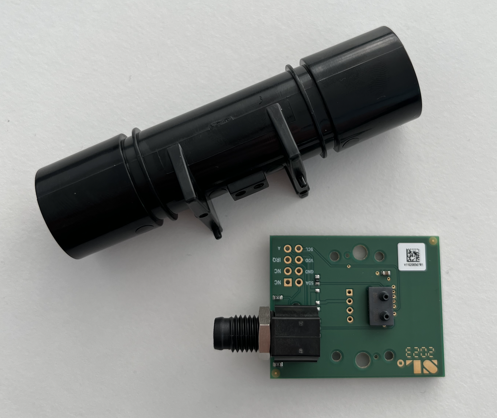
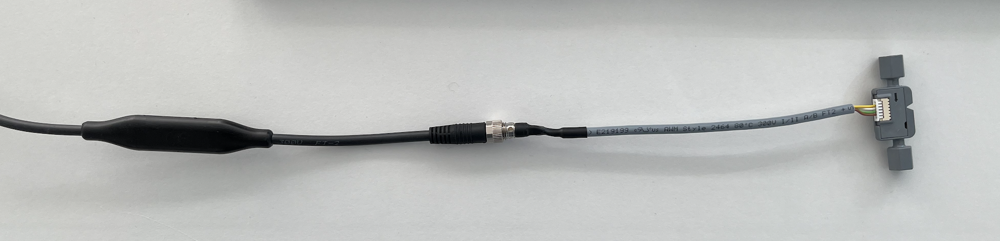
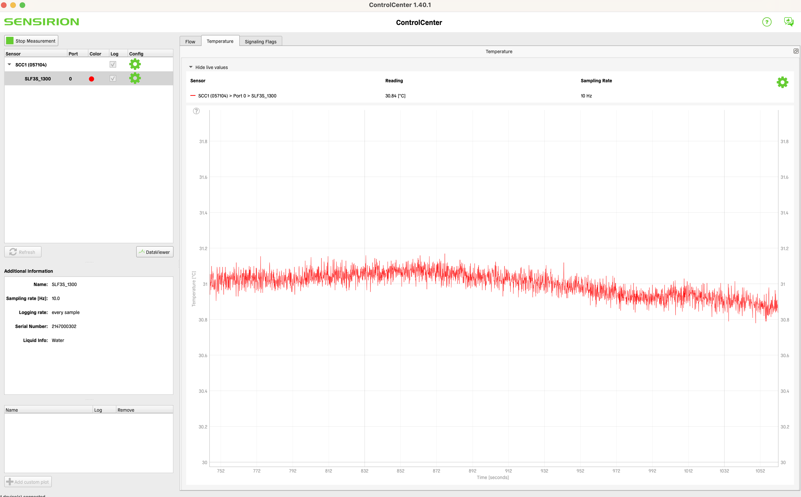

# Gas flow sensor / liquid flow sensor

The project idea is to measure CO2 production while fermenting beer.

## Original kit: SDP3X

The [Sensirion SDP3X **gas** flow sensor](https://www.sensirion.com/products/catalog/SEK-SDP31)
would be attached to the pressure relief valve of the fermenting tank.
Sadly I couldn't get the sensor working on my Mac with USB via the SHDLC cable.
It wouldn't show up in the Sensirion Control Center.



## Fallback kit: SLF3S-1300F

So I played around with the **liquid** flow sensor
[SLF3S-1300F](https://sensirion.com/products/catalog/SLF3S-1300F) (SF06 chip) instead.



### Hardware setup

1. Connect sensor to SHDLC cable via I2C.
2. Connect SHDLC cable to Mac via USB.
3. (Optional) Install [Sensirion Control Center](https://www.sensirion.com/de/produkte/sensor-evaluation/control-center/)
   to test the sensor.
   
5. Have relevant data sheets ready:
   * [SHDLC protocol documentation](https://media.digikey.com/pdf/Data%20Sheets/Sensirion%20PDFs/LQ_AN_RS485SensorCable_ImplementationGuideToSHDLC_EN_1_D2.pdf)
   * [SHDLC command documentation](https://media.digikey.com/pdf/Data%20Sheets/Sensirion%20PDFs/LQ_CO_RS485SensorCable_SHDLC_Commands_D2.pdf)
     Section 2.5 for SF06 (`type=3`)
   * [SLF3S-1300F](https://sensirion.com/media/documents/6971528D/63625D22/Sensirion_Datasheet_SLF3S-1300F.pdf)

### Software setup

```sh
asdf install python latest:3.8
pip install poetry
poetry init
poetry env use $(asdf which python)
poetry shell
poetry add sensirion-shdlc-driver
```

### Python Code to read measurements

```py
from sensirion_shdlc_driver import ShdlcSerialPort, ShdlcConnection, ShdlcDevice
from sensirion_shdlc_driver.command import ShdlcCommand
from struct import unpack

# import logging
# logging.basicConfig(level=logging.DEBUG)

# Get port name with `ls /dev | grep usbserial`
with ShdlcSerialPort(port='/dev/cu.usbserial-FT664PUW', baudrate=115200) as port:
    device = ShdlcDevice(ShdlcConnection(port), slave_address=0)

    # Ask the SHDLC smart cable for its specifications
    print("Version: {}".format(device.get_version()))
    print("Product Name: {}".format(device.get_product_name()))
    print("Article Code: {}".format(device.get_article_code()))
    print("Serial Number: {}".format(device.get_serial_number()))

    raw_response = device.execute(ShdlcCommand(
        id=0x30,  # Sensor status (section 3.2.1 of SHDLC commands)
        data=b'',  # No payload
        max_response_time=0.2,
    ))
    print(raw_response)

    raw_response = device.execute(ShdlcCommand(
        id=0x34,  # Stop continuous measurement (section 3.2.5 of SHDLC commands)
        data=b'',  # No payload
        max_response_time=0.2,  # Maximum response time in Seconds
    ))
    print(raw_response)

    raw_response = device.execute(ShdlcCommand(
        id=0x33,  # Start continuous measurement with command (section 3.2.4 of SHDLC commands, page 29)
        data=b'\x00\x64\x36\x08',  # [resolution of 100ms, measure water]
        max_response_time=0.2,  # Maximum response time in Seconds
    ))
    print(raw_response)

    while True:
        raw_response = device.execute(ShdlcCommand(
            id=0x35,  # Get last measurement advanced (section 3.2.7 of SHDLC commands)
            data=bytearray([0b0000_0010]),  # Set bit for reading all 3 measurements (flow, temp, flags)
            max_response_time=0.2,  # Maximum response time in Seconds
            min_response_length=6
        ))

        flow, temp, sig = unpack('>hhH', raw_response)

        # Scale according to section 4.5.1 of SLF3S-1300F datasheet
        flow /= 500
        temp /= 200
        print("raw={} flow={:.3f} temp={:.3f} flags={:016b}".format(raw_response.hex(), flow, temp, sig))
```

This will produce readings like this:
```sh
raw=0001184c0001 flow=0.002 temp=31.100 flags=0000000000000001
```
