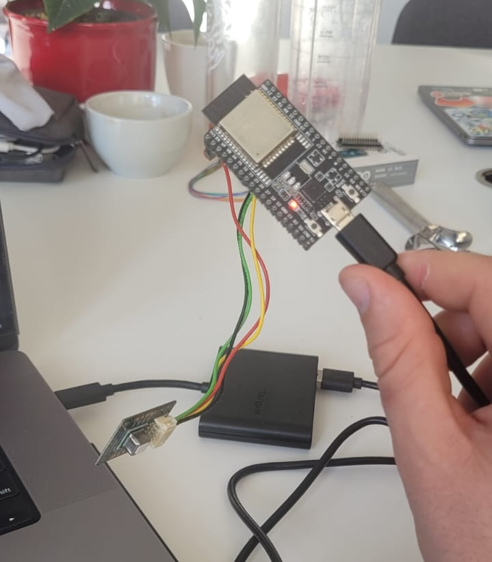
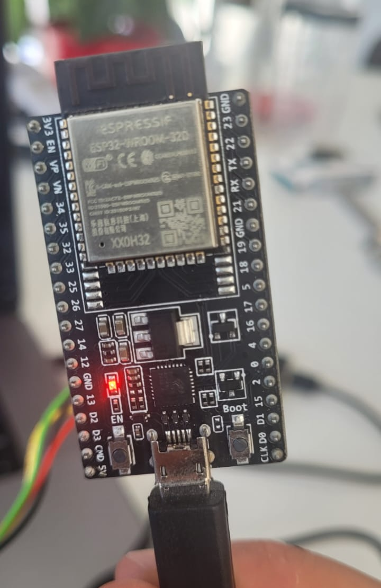
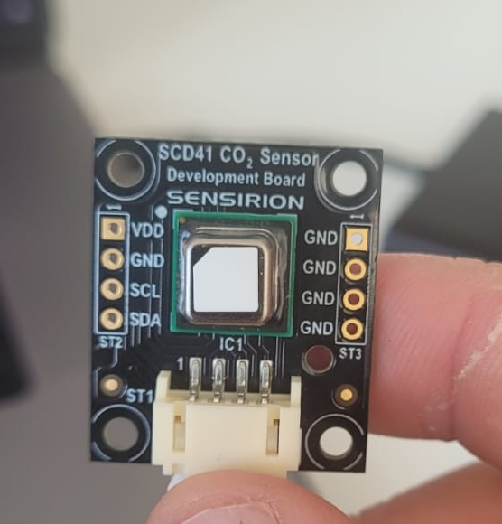
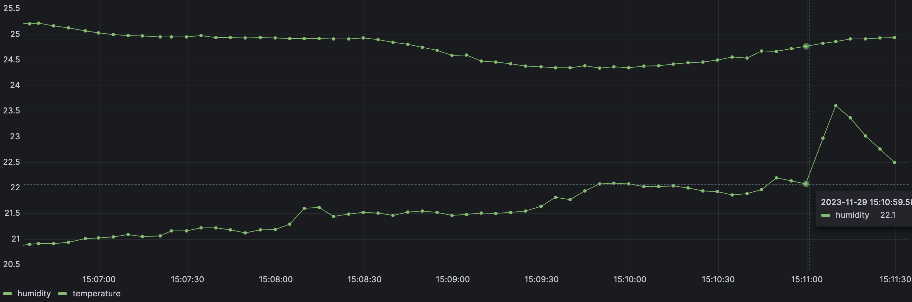
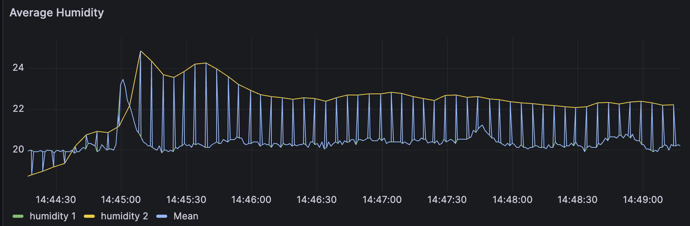

# Humidity, temperature and CO2 sensor

We want to monitor these values in order to ensure that safe pool can be played in the break room. The aim would be to be able to connect the board to the wifi, keep this running with a power source only, persist the readings to a time-series database and visualize the data in a dashboard using Grafana.

# Setting up the kit

### Overall setup



### ESP32 board



### SCD41 CO2 sensor



# Arduino

In order to set up the board and sensor we used the Arduino IDE, with the ESP32 Dev Module. 

We used the Sensirion I2C SCD4x library which allowed us to initially set up the sensor, get the device ID, get the readings and print them to the serial monitor locally.

# Influx DB

We wanted to use InfluxDB which is a time-series database. We created this using the UI and used the providing Arduino code to write to the database. This also included setting up WiFi on the board so that it could be connected to the internet and write to the database with only a power source.

Then we combined the two Arduino scripts to get the readings and write these to the database. The final script was as follows:

```c
#if defined(ESP32)
  #include <WiFiMulti.h>
  WiFiMulti wifiMulti;
  #define DEVICE "ESP32"
  #elif defined(ESP8266)
  #include <ESP8266WiFiMulti.h>
  ESP8266WiFiMulti wifiMulti;
  #define DEVICE "ESP8266"
  #endif
  #include <InfluxDbClient.h>
  #include <InfluxDbCloud.h>
  #define WIFI_SSID "Renuo Wifi"
  #define WIFI_PASSWORD "stage-bitt-minus-lag"
  #define INFLUXDB_URL "https://eu-central-1-1.aws.cloud2.influxdata.com"
  #define INFLUXDB_TOKEN "6oALF2SzvJiqk31ax50bfG92rZo-Jshif3nzY-hw36iU-MkbyO142KSr2MpfBMCi0kDgmX70SArzpShXSku65w=="
  #define INFLUXDB_ORG "31c89f2dc9a18594"
  #define INFLUXDB_BUCKET " "
  // Time zone info
  #define TZ_INFO "UTC1"
  // Declare InfluxDB client instance with preconfigured InfluxCloud certificate
  InfluxDBClient client(INFLUXDB_URL, INFLUXDB_ORG, INFLUXDB_BUCKET, INFLUXDB_TOKEN, InfluxDbCloud2CACert);
  // Declare Data point
  Point sensor("wifi_status");

  #include "Sensirion_Gadget_BLE.h"
  #include <SensirionI2CScd4x.h>

  // GadgetBle workflow
  static int64_t lastMeasurementTimeMs = 0;
  static int measurementIntervalMs = 5000;
  NimBLELibraryWrapper lib;
  DataProvider provider(lib, DataType::T_RH_CO2);

  SensirionI2CScd4x scd4x;

  void setup() {
    Serial.begin(115200);
    
    // Setup wifi
    WiFi.mode(WIFI_STA);
    wifiMulti.addAP(WIFI_SSID, WIFI_PASSWORD);
    Serial.print("Connecting to wifi");
    while (wifiMulti.run() != WL_CONNECTED) {
      Serial.print(".");
      delay(100);
    }
    Serial.println();
    // Accurate time is necessary for certificate validation and writing in batches
    // We use the NTP servers in your area as provided by: https://www.pool.ntp.org/zone/
    // Syncing progress and the time will be printed to Serial.
    timeSync(TZ_INFO, "pool.ntp.org", "time.nis.gov");
    // Check server connection
    if (client.validateConnection()) {
      Serial.print("Connected to InfluxDB: ");
      Serial.println(client.getServerUrl());
    } else {
      Serial.print("InfluxDB connection failed: ");
      Serial.println(client.getLastErrorMessage());
    }
    // sensor.addTag("SSID", WiFi.SSID());

    // Initialize the GadgetBle Library
    provider.begin();
    Serial.print("Sensirion GadgetBle Lib initialized with deviceId = ");
    Serial.println(provider.getDeviceIdString());

    sensor.addTag("device_id", provider.getDeviceIdString());
    
    // init I2C
    Wire.begin();

    uint16_t error;
    char errorMessage[256];

    scd4x.begin(Wire);

    // stop potentially previously started measurement
    scd4x.stopPeriodicMeasurement();

    // Start Measurement
    error = scd4x.startPeriodicMeasurement();
    if (error) {
        Serial.print("Error trying to execute startPeriodicMeasurement(): ");
        errorToString(error, errorMessage, 256);
        Serial.println(errorMessage);
    }

    Serial.println("Waiting for first measurement... (5 sec)");
    Serial.println("CO2(ppm)\tTemperature(degC)\tRelativeHumidity(percent)");
    delay(5000);

  }
  void loop() { 
    
  sensor.clearFields();

  if (wifiMulti.run() != WL_CONNECTED) {
    Serial.println("Wifi connection lost");
  }

  if (millis() - lastMeasurementTimeMs >= measurementIntervalMs) {
    measure_and_report();
  }

  provider.handleDownload();
  delay(1);
}

void measure_and_report() {
  uint16_t error;
  char errorMessage[256];
    
  // Read Measurement
  uint16_t co2;
  float temperature;
  float humidity;

  error = scd4x.readMeasurement(co2, temperature, humidity);
  lastMeasurementTimeMs = millis();

  if (error) {
    Serial.print("Error trying to execute readMeasurement(): ");
    errorToString(error, errorMessage, 256);
    Serial.println(errorMessage);
    return;
  }

  if (co2 == 0) {
    Serial.println("Invalid sample detected, skipping.");
    return;
  }
  
  Serial.print("co2: ");
  Serial.print(co2);
  Serial.print("\t");
  Serial.print("temperature: ");
  Serial.print(temperature);
  Serial.print("\t");
  Serial.print("humidity: ");
  Serial.println(humidity);

  sensor.addField("co2", co2);
  sensor.addField("temperature", temperature);
  sensor.addField("humidity", humidity);

  if (!client.writePoint(sensor)) {
    Serial.print("InfluxDB write failed: ");
    Serial.println(client.getLastErrorMessage());
  }
}

```

# Grafana

We then set up Grafana to visualize the data. We used the InfluxDB as the data source (via FlightSQL plugin as the InfluxDB setup caused issues...) and then created a dashboard.

Here is an example of a chart that could be created:



We then wanted to collaborate with the other team to combine the data from the two sensors. We set up our database on their Grafana instance and now had access to multiple sensors in different locations with different device IDs.

### Time issues on calculating mean

We wanted to combine the two humidity readings and show a moving average. However the mean was basically jumping from one line to the other due to timing issues.



How did we fix this @jonathan? :D We didn't....

Our plan would be that for a point in time, it would find the latest data point on each sensor and then calculate the mean. However, we didn't manage to do this because Grafana is pretty limited.

# Conclusions

- Working with physical devices is fun
- We learned a lot about the different components and how they work together - writing the code to the ESP32 board, setting up the database and setting up WiFi on the board
- Grafana is nice but a bit limited... I would have preferred to set up a real backend and either built our own frontend or us a more flexible tool
- InfluxDB is nice but connecting it to Grafana was a bit of a pain even though it should be easy

# Other use cases

- We didn't manage to combine the data from the two sensors in any meaningful way... but there's definitely some nice ideas here - thinking something like moisture sensors in different areas that could be used to determine when to water plants, or something cool like that
